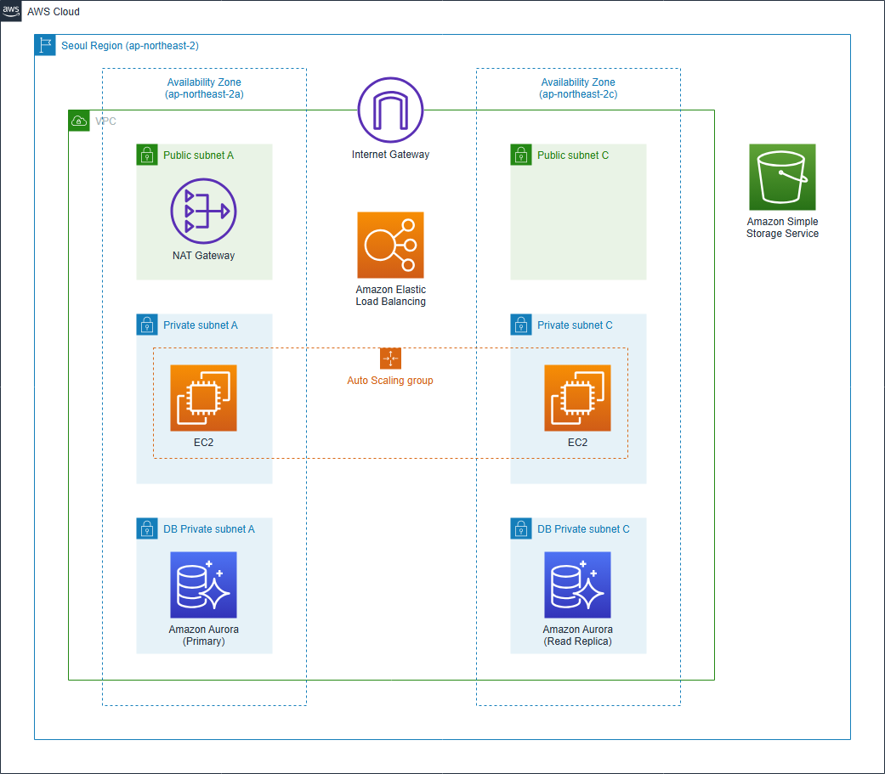
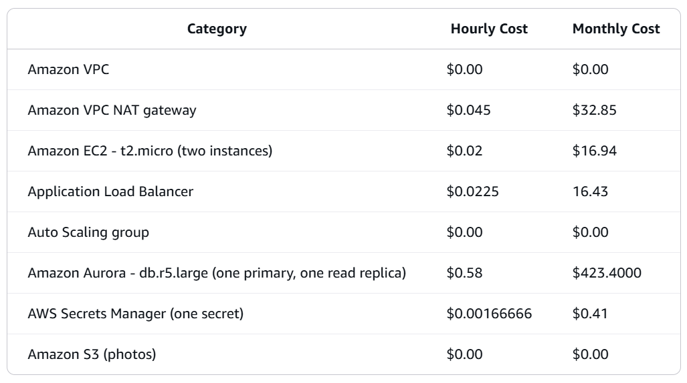

# Hands on Lab Overview

# Hands on Lab Configuration

Specifically, we will walk you through the following topics.

1. Network – Amazon VPC
2. Compute – Amazon EC2
3. Database – Amazon Aurora
4. Storage – Amazon S3
5. Clean up resource

# Workshop Costs

Total workshop costs if resoures are deleted after completing the labs: $1.33 - $2.67
