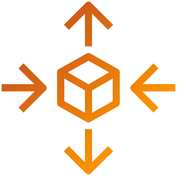

# Lets dive in to working on an Auto Scaling lab for AWS. 

AWS Auto Scaling helps you manage your applications by automatically adjusting the number of resources to keep performance steady and costs low. It’s easy to set up and can scale various resources like EC2 instances, ECS tasks, DynamoDB tables, and Aurora databases.

This lab shows you how to use EC2 Auto Scaling during busy times with a custom AMI.

First, you’ll learn to create an Amazon Machine Image (AMI) from a web host made with CloudFormation.

Then, you’ll create a launch template and set up the web host in an auto scaling group behind an Application Load Balancer (ALB).

In the end, you’ll have an auto scaling group that adjusts based on the CPU utilization of the hosts.

**Key points:**

Automatic Adjustments: Monitors and adjusts resources as needed.

User-Friendly: Simple interface to create scaling plans.

Multiple Resources: Works with EC2, ECS, DynamoDB, Aurora, and more.

Optimization: Offers recommendations to balance performance and cost.

Integration: Can be combined with EC2 Auto Scaling for broader resource management.

This ensures your applications always have the right amount of resources at the right time.

# Here’s a brief overview of the steps involved:

Lab Prerequisites: Ensure you have the necessary permissions and resources set up in your AWS account.

Creating a Launch Template: Define the configuration for your EC2 instances, including the AMI, instance type, key pair, and security groups.

Setup an Auto Scaling Group: Create an Auto Scaling group that uses your launch template to automatically manage the number of instances based on demand.

Configuring Security Groups: Set up security groups to control inbound and outbound traffic to your instances.

Testing the Auto Scaling Group: Simulate load to test how your Auto Scaling group responds by adding or removing instances.

Auto Scaling Lab Teardown: Clean up resources by terminating instances and deleting the Auto Scaling group to avoid unnecessary charges.