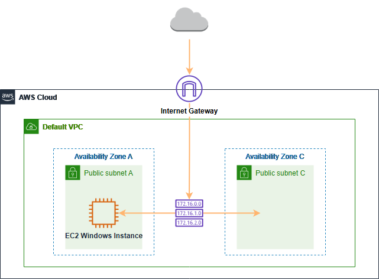

# EC2 Windows Hands-on Lab. 

Here's a quick overview of the steps involved:

1. **Create a New Key Pair**: This is essential for securely accessing your instance.

2. **Launch a Web Server Instance**: Start your EC2 instance using an appropriate Amazon Machine Image (AMI) for Windows.

3. **Connecting to your Windows Instance**: Use Remote Desktop Protocol (RDP) to connect to your instance.

4. **Connect to your Windows instance using Session Manager (Optional)**: AWS Systems Manager Session Manager allows you to connect without needing RDP.

5. **Change EC2 Instance Type (Optional)**: Adjust the instance type based on your needs.

6. **Elastic IPs (Optional)**: Assign a static IP address to your instance for consistent access.

7. **Clean Up Resources**: Terminate your instance and delete any resources you no longer need to avoid unnecessary charges.