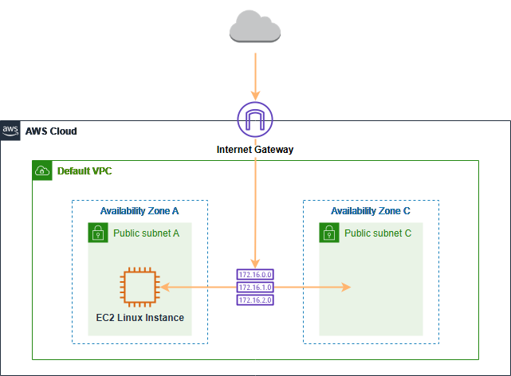

Amazon EC2 offers flexible computing resources in the Amazon Web Services (AWS) Cloud. 

With Amazon EC2, there's no need to invest in hardware upfront, allowing you to develop and deploy applications more quickly. 

You can launch as many virtual servers as you require, set up security and networking, and manage storage easily. 

Amazon EC2 also allows you to adjust your resources up or down based on changing needs or sudden increases in demand, minimizing the need for traffic forecasting.

