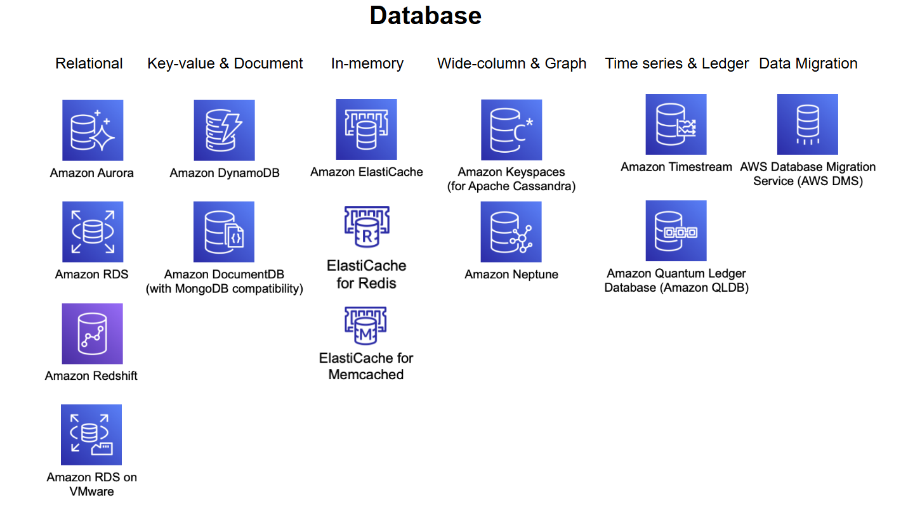

# Database - Amazon RDS

AWS provides the broadest selection of purpose-built databases for all your application. 15+ purpose-built database  engines allow you to save, grow, and innovate faster.

Hundreds of thousands of customers rely on AWS databases which have the following characteristics:

• Purpose-built database
• Performance at scale
• Fully managed
• Secure & highly available

Customers  across industries turn to AWS purpose-built databases to power their most important applications such as:

• Internet Scale Applications
• Real-time applications
• Open source applications
• Enterprise applications