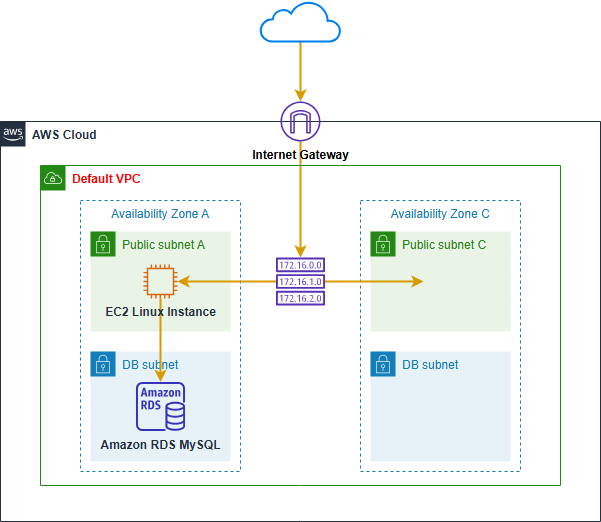
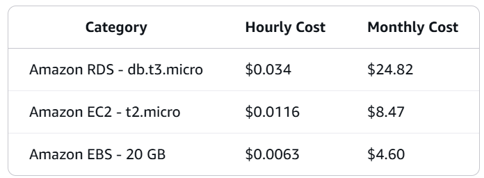

# Amazon RDS MySQL Hands on Lab

# Amazon RDS Overview

Amazon RDS is a web service that makes it easy to set up, operate, and scale a relational database in the cloud. 

It provides cost-efficient and resizable capacity while managing time-consuming database administration tasks, freeing you up to focus on your applications and business.

This lab will walk you through the following:

• Create VPC Security Group
• Launch an RDS Instance
• Save RDS Credentials
• Access RDS from EC2
• Create an RDS Snapshot (Optional)
• Modify RDS Instance Size (Optional)
• Clean Up Resources

# Workshop Costs

Total workshop costs: $0.15 - $1.00