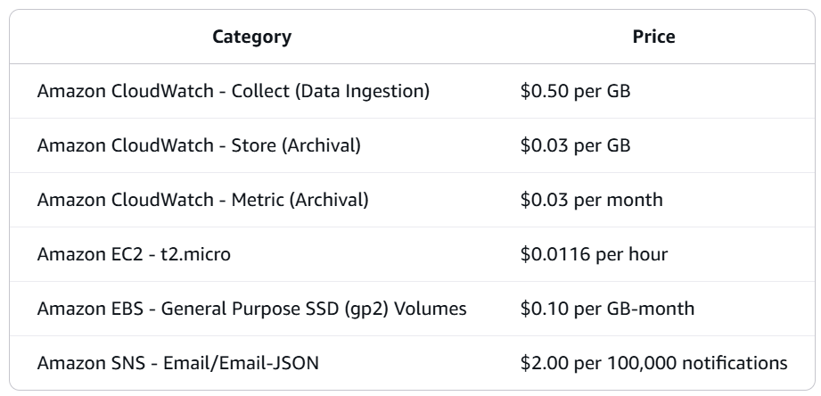

# Amazon CloudWatch Overview

In this lab, you will utilize CloudWatch to track EC2 CPU utilization and set up Alarm based on a configured threshold. 

The Alarm will trigger a Simple Notification Service(SNS) notification.

This hands on lab is broken into the following parts:

• Create Simple Notification Service (SNS) Topic
• Launch an Elastic Compute Cloud (EC2) Instance
• Configure a CloudWatch Alarm

Workshop Costs

Total workshop costs: $0.5 - $1.00
