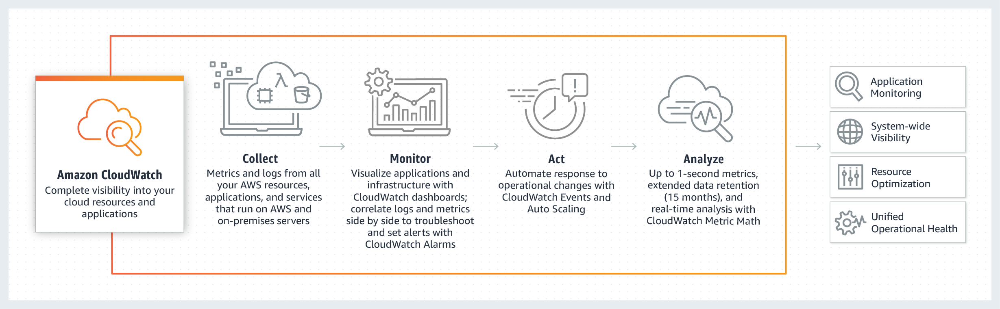

# Monitoring - Amazon CloudWatch

Amazon CloudWatch  is a monitoring and observability service built for DevOps engineers, developers, site reliability engineers (SREs), and IT managers. CloudWatch provides you with data and actionable insights to monitor your applications, respond to system-wide performance changes, optimize resource utilization, and get a unified view of operational health. CloudWatch collects monitoring and operational data in the form of logs, metrics, and events, providing you with a unified view of AWS resources, applications, and services that run on AWS and on-premises servers. You can use CloudWatch to detect anomalous behavior in your environments, set alarms, visualize logs and metrics side by side, take automated actions, troubleshoot issues, and discover insights to keep your applications running smoothly.

# Use Cases

Infrastructure monitoring and troubleshooting
Monitor key metrics and logs, visualize your application and infrastructure stack, create alarms, and correlate metrics and logs to understand and resolve root cause of performance issues in your AWS resources. This includes monitoring your container ecosystem across Amazon ECS, AWS Fargate, Amazon EKS, and Kubernetes.

# Application monitoring

Monitor your applications that run on AWS (on Amazon EC2, containers, and serverless) or on-premises. CloudWatch collects data at every layer of the performance stack, including metrics and logs on automatic dashboards.

# Log analytics

Explore, analyze, and visualize your logs to address operational issues and improve applications performance. You can perform queries to help you quickly and effectively respond to operational issues. If an issue occurs, you can start querying immediately using a purpose-built query language to rapidly identify potential causes.

# Improve operational performance and resource optimization

Amazon CloudWatch enables you to set alarms and automate actions based on either predefined thresholds, or on machine learning algorithms that identify anomalous behavior in your metrics. For example, it can start Amazon EC2 Auto Scaling automatically, or stop an instance to reduce billing overages. You can also use CloudWatch Events for serverless to trigger workflows with services like AWS Lambda, Amazon SNS, and AWS CloudFormation.