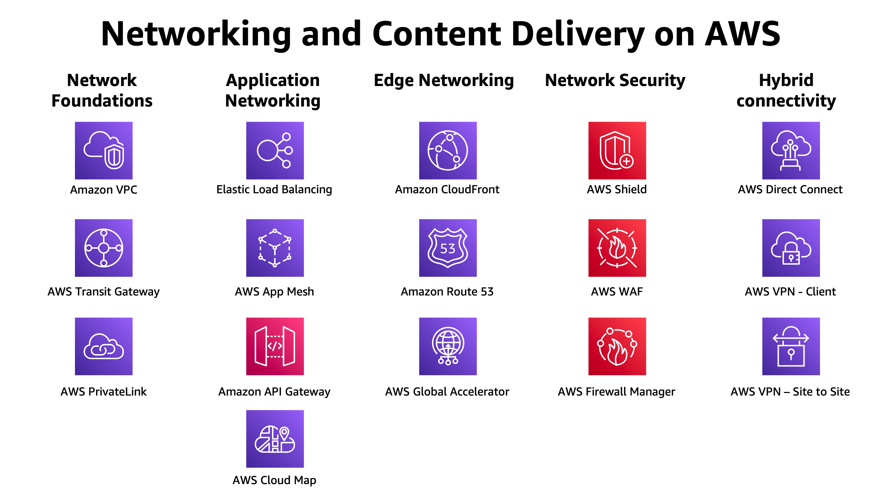

# AWS provides the broadest and deepest set of networking services with the highest reliability, most security features, and highest performance in the world. This helps ensure you can run any kind of workload you have in the cloud.

** AWS Networking services  have the following characteristics: **

• More secure
• Highest network availability
• Consistent high performance
• Broadest global coverage