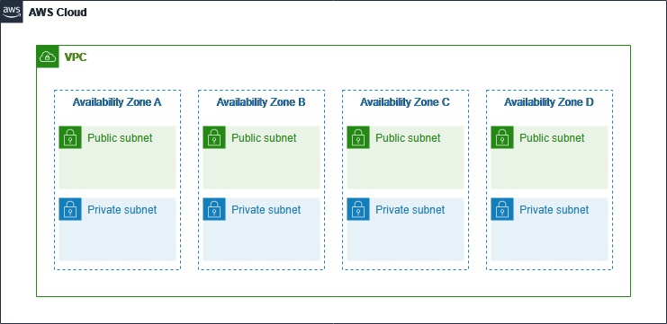

# VPC Hands on Lab

# Amazon VPC(Virtual Private Cloud) Overview

Amazon Virtual Private Cloud(Amazon VPC)  enables you to launch AWS resources into a virtual network that you’ve defined. 

This virtual network closely resembles a traditional network that you’d operate in your own data center, with the benefits of using the scalable infrastructure of AWS.

Amazon VPC lets you provision a logically isolated section of the AWS Cloud where you can launch AWS resources in a virtual network that you define. 

You have complete control over your virtual networking environment, including selection of your own IP address range, creation of subnets, and configuration of route tables and network gateways.

You can use both IPv4 and IPv6 in your VPC for secure and easy access to resources and applications.

# Lab Order

• Create a VPC
• Create additional subnets
• Edit the routing table
• Create a Security Group
• Test Connectivity
• Clean up resources

# Workshop Costs

While there is no additional charge for creating and using an Amazon Virtual Private Cloud (VPC) itself, you can pay for optional VPC capabilities with usage-based charges. 

AWS provides features and services that give you the ability to customize control, connectivity, monitoring, and security for your Amazon VPC.