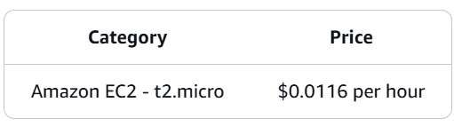

# Provisioning - AWS CloudFormation

# Welcome to CloudFormation Intro Workshop

What is CloudFormation Definition:

AWS CloudFormation is a service that helps you model and set up your AWS resources so that you can spend less time managing those resources and more time focusing on your applications that run in AWS. 

You create a template that describes all the AWS resources that you want (like Amazon EC2 instances or Amazon RDS DB instances), and CloudFormation takes care of provisioning and configuring those resources for you.

AWS CloudFormation can help in :

• Simplify infrastructure management
• Quickly replicate your infrastructure
• Easily control and track changes to your infrastructure

# Workshop Costs
There is no additional charge for using AWS CloudFormation with resource providers in the following namespaces: AWS::, Alexa::, and Custom::. In these cases, you pay for AWS resources such as Amazon Elastic Compute Cloud (EC2) instances, Elastic Load Balancing load balancers, etc. created using AWS CloudFormation the same as if you had created them manually. You only pay for what you use, with no minimum fees and no required upfront commitments.

Total workshop costs: $0.5 - $1.00