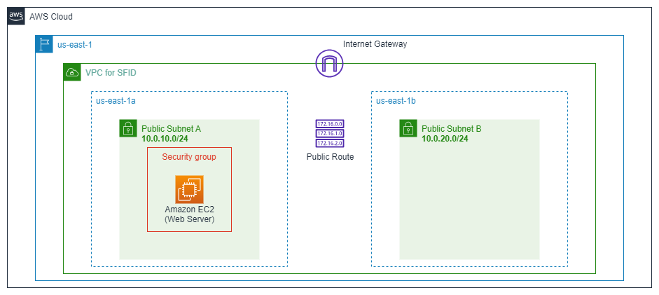

# Setting up an EC2 Instance

Overview

This lab will start with the most basic template mimicking the Compute – Amazon EC2 Hands-on Lab for the AWS General Immersion Day.

By the end of this lab, you will be able to:

Write a basic CloudFormation template that creates an EC2 Linux Instance, which will act as a Web Server.

# Launch EC2 Instance

Let’s create a simple EC2 Instance using CloudFormation

1) Open a text editor and create an empty YAML File called sfid-cfn-ec2.yaml
2) Copy and paste the sample CloudFormation template that defines an EC2 and save the file.

Resources:
# Create EC2 Linux
  WebServerInstance:
    Type: AWS::EC2::Instance
    Properties:
      ImageId: "ami-07caf09b362be10b8"
      InstanceType: t3a.micro

3) Open the AWS CloudFormation Console 
4) Click on Create Stack.
5) In Prepare template, choose Template is ready.
6) In Template source, choose Upload a template file.
7) Click on Choose file button and navigate to where the sfid-cfn-ec2.yaml was saved.
8) Select the file sfid-cfn-ec2.yaml and Click Open.
9) Click Next.
10) Provide a Stack name and Click Next.
        a) The Stack name identifies the stack. Use a name to help you distinguish the purpose of this stack.
        b) Recommend using SFID-CFN-EC2 for the purpose of our lab.
11) You can leave Configure stack options default, click Next.
12) On the Review SFID-CFN-EC2 page, scroll down to the bottom and choose Submit.
13) You can click the refresh button a few times until you see in the status CREATE_COMPLETE.
14) Open the AWS EC2 Console  to check the EC2 created using AWS CloudFormation.

Now we created a simple EC2 Instance, however it’s not labeled and we didn’t pass the User Data.
