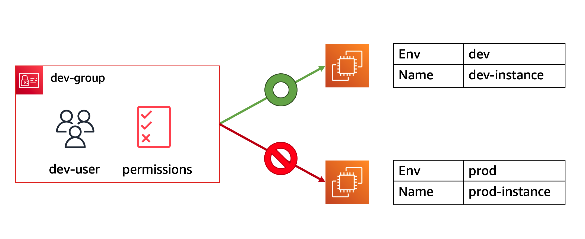

# Identity & Access Management (IAM) Overview

AWS Identity and Access Management (IAM)  is a web service that helps you securely control access to AWS resources. You use IAM to control who is authenticated (signed in) and authorized (has permissions) to use resources.

When you first create an AWS account, you begin with a single sign-in identity that has complete access to all AWS services and resources in the account. This identity is called the AWS account root user and is accessed by signing in with the email address and password that you used to create the account.

# AWS IAM key components:

• IAM Identities
• IAM Users 
• IAM User groups 
• IAM Roles 
• IAM Policy 

This hands on lab is broken into the following parts:

Launch EC2 Instances with Tags
Create AWS IAM Identities
Test the access for resources
Assign IAM Role for EC2 Instance and Test the access
