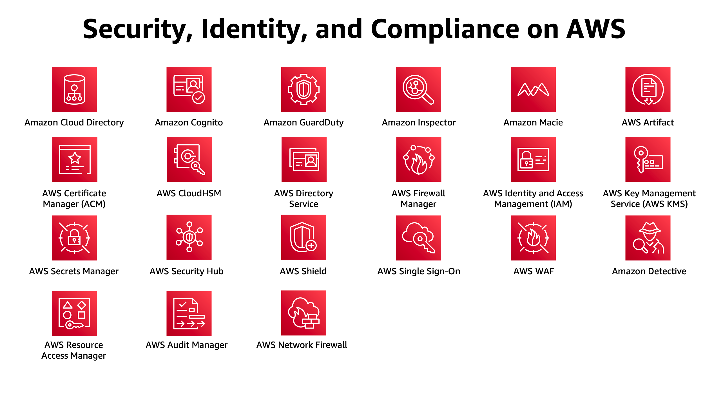

Using AWS, you will gain the control and confidence you need to securely run your business with the most flexible and secure cloud computing environment available today. As an AWS customer, you will benefit from AWS data centers and a network architected to protect your information, identities, applications, and devices. With AWS, you can improve your ability to meet core security and compliance requirements, such as data locality, protection, and confidentiality with our comprehensive services and features.

AWS allows you to automate manual security tasks so you can shift your focus to scaling and innovating your business. Plus, you pay only for the services that you use. All customers benefit from AWS being the only commercial cloud that has had its service offerings and associated supply chain vetted and accepted as secure enough for top-secret workloads.

