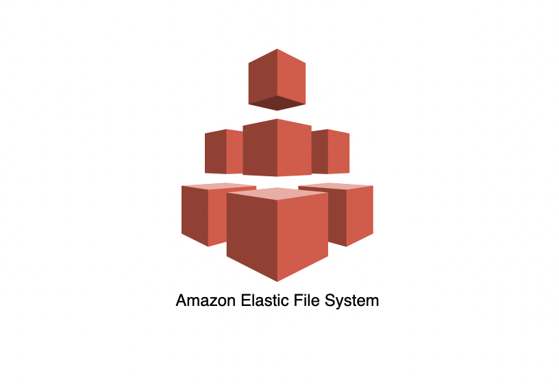
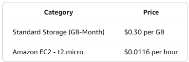

# Amazon Elastic File System

# Amazon Elastic File System (EFS) Hands-On Lab

Amazon Elastic File System (EFS) is designed to provide serverless, fully elastic file storage that lets you share file data without provisioning or managing storage capacity and performance. 

Amazon Elastic File System (EFS) automatically grows and shrinks as you add and remove files with no need for management or provisioning.

In this lab we will design an Elastic File System drive and connect it to two Elastic Compute nodes.

In this lab, we will complete the following:

• Create a Virtual Private Cloud (VPC) with two Public Subnets
• Create Security Groups for EC2 and EFS
• Create an Elastic File system (EFS)
• Create the first EC2 Instance and Mount our EFS drive
• Create the second EC2 Instance and Mount our EFS drive
• Connect to both EC2 instances using Instance Connect
• Create a file on EFS drive
• Demonstrate the EFS mount from the second instance
• Clean up

# Workshop Costs

There is no minimum fee or setup charge. 
You pay only for the storage you use, for read and write access to data stored in Infrequent Access storage classes, for read and write access using Elastic Throughput, and for any Provisioned Throughput. 
Amazon EFS offers four storage classes: two standard storage classes, including Amazon EFS Standard and Amazon EFS Standard-Infrequent Access (EFS Standard-IA), and two One Zone storage classes, including Amazon EFS One Zone and Amazon EFS One Zone-Infrequent Access (EFS One Zone-IA).

EFS offers price advantages over many self-managed cloud alternatives. For more information on how much you can save, see the EFS Total Cost of Ownership (TCO) example here.

Total workshop costs: $0.5 - $1.00