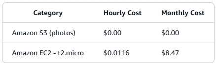

# Amazon S3 Overview

Amazon Simple Storage Service (Amazon S3) is an object storage service that offers industry-leading scalability, data availability, security, and performance. 

It can be used to store and retrieve any amount of data, at any time, from anywhere on the web.

This lab is designed to give you some experience interacting with the S3 service through the AWS Console and demonstrate the use case of securely accessing objects within a private S3 bucket through an EC2 web host.

# This lab will walk you through the following:
• Creating a bucket in S3
• Adding objects to your S3 bucket
• Working with objects in the S3 Console
• Accessing objects stored in S3
• Enabling bucket versioning
• Setting up a Lifecycle Policy
• Cleanup: Deleting the objects and the S3 bucket

# Lab Costs

Total workshop costs: $0.50 - $1.00