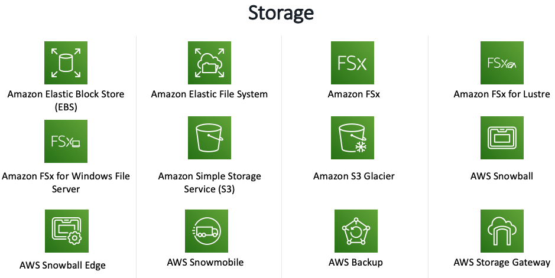

# Storage - Amazon S3 & EFS

AWS offers a complete range of services for you to store, access, govern, and analyze your data to reduce costs, increase agility, and accelerate innovation.

Select from object storage, file storage, and block storage services, backup, and data migration options to build the foundation of your cloud IT environment.

